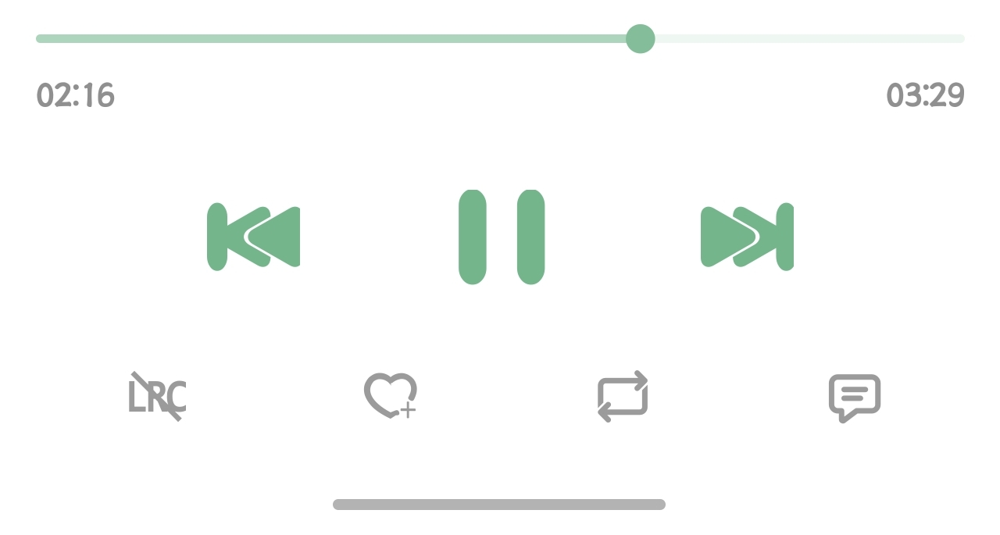

# 流音 (liuyin-music)

一款基于 [lx-music-mobile](https://github.com/lyswhut/lx-music-mobile) 二次开发的 Android 音乐播放器，深度适配 [XCQ0607/lxserver](https://github.com/XCQ0607/lxserver) 自建服务器（Subsonic + 自定义音源）场景，重点打磨了播放稳定性与后台/锁屏播放体验。

<p align="center">
  
</p>

## 主要改动（相对上游 lx-music-mobile）

- **播放器整体替换为 Media3（AndroidX Media3 ExoPlayer + MediaSessionService）**
  - 替换 react-native-track-player（旧 MediaSessionCompat + ExoPlayer 2.x），锁屏/通知栏媒体控件由 Media3 标准流程驱动
  - 播放结束看门狗：后台 JS 定时器不可靠时保证自动切歌不中断
- **完整的音频焦点处理**
  - 其他播放器抢占焦点 → 彻底停止，等待手动恢复
  - 来电 / 语音助手 / VoIP 通话 → 暂停，结束后自动续播
  - 导航提示音 / 消息提示音 → 音量自动压低至约 20%，结束后还原
  - 可在设置中关闭（「程序处理音频焦点」开关）
- **播放解析兜底链**
  - 缓存 → 内部 API 多源轮询（音质自动降级）→ 跨平台换源 → Subsonic stream 兜底
  - 播放错误自动丢弃坏缓存并重新解析，连续失败自动切歌
- **收藏 / 歌单同步**
  - 与服务器 Web 播放器双向同步收藏，60 秒轮询 + 回前台即时同步
- **排行榜 / 歌单 / 专辑 / 歌手页播放修复**
  - 按 ID 播放替代按可见索引播放，先取全量列表再入队，消除切歌错乱
- **Media3 播放缓存**：SimpleCache + CacheDataSource，缓存大小统计与清理包含歌曲与图片缓存
- **其他**：收藏确认弹窗、繁体中文支持等细节改进

## 构建方法

环境要求：

- Node.js（版本见 `.nvmrc`）
- JDK 17、Android SDK（Android Studio 或命令行工具）
- Yarn 或 npm

```bash
yarn install          # 或 npm install
cd android
./gradlew assembleRelease -PreactNativeArchitectures=arm64-v8a
```

产物位于 `android/app/build/outputs/apk/release/`。

调试运行：

```bash
yarn dev
```

## 免责声明

本项目仅供学习与技术研究使用，不提供任何音源，不存储任何音频文件。请支持正版音乐。

## 致谢

- [lyswhut/lx-music-mobile](https://github.com/lyswhut/lx-music-mobile)：本项目基于其二次开发
- [XCQ0607/lxserver](https://github.com/XCQ0607/lxserver)：本项目深度适配的自建服务端
- [lyswhut/lx-music](https://github.com/lyswhut/lx-music-desktop) 及相关开源社区

## 许可证

本项目沿用上游的 [Apache License 2.0](LICENSE) 许可证。所有修改在相同许可证下发布。
