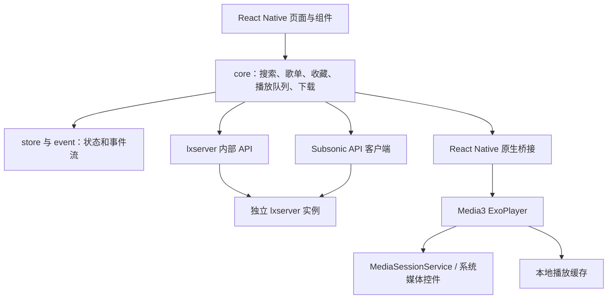

# 流音（LiuYin Music）项目介绍

> 本文介绍的是本目录中的 **v1.10 源码快照**，以当前代码和构建配置为准。仓库自带的 `README.md`、`FAQ.md` 主要来自上游 LX Music 移动版，部分功能说明可能早于本分支。

## 1. 项目概况

流音是一款基于 **LX Music 移动版**二次开发的 React Native 音乐播放器客户端。它把 Android 原生播放器、LX Music 的界面与播放列表机制、以及独立部署的 **lxserver（落雪服务器）**连接起来，提供在线搜索、播放、歌单/排行榜浏览、歌词展示、收藏同步和本地下载等能力。

| 项目项 | 当前源码信息 |
| --- | --- |
| 应用名称 | 流音（LiuYin Music） |
| 源码包名 | `lx-music-mobile` |
| Android applicationId | `cn.lycool.app` |
| 应用显示名 | `流音` |
| 版本 | `1.10` |
| versionCode | `90`（分 ABI APK 会使用独立覆盖码 `90001`–`90004`） |
| 主要运行平台 | Android；本目录也包含 React Native iOS 工程文件，但 v1.10 的定制播放器与发布构建以 Android 为准 |
| 服务端 | 单独部署并配置的 lxserver；不包含在本客户端源码目录内 |

客户端源码不等于音乐服务端：歌单广场、排行榜、音源搜索与播放链接解析等在线能力需要连接兼容的 lxserver 实例。

## 2. 主要功能

### 在线音乐

- 支持酷我（`kw`）、酷狗（`kg`）、QQ/腾讯（`tx`）、网易（`wy`）、咪咕（`mg`）五类音源。
- 搜索歌曲、歌单与联想词；“全部”歌曲搜索由客户端并行查询多个音源，单源最多 15 首、限时 2.5 秒并渐进展示结果，旧请求不会覆盖新搜索结果。
- 浏览歌单类别/标签、热门或最新歌单、排行榜、热搜与歌单详情。
- 播放链接优先通过 lxserver 内部 API 解析，支持链接可用性探测、质量降级、跨音源匹配及 Subsonic stream 兜底。
- **链接解析提速（v1.10）**：
  - 直链与服务器代理**并行**探测（最坏等待 6 秒 → 2 秒），探测超时 2 秒；
  - 服务端返回“无其它音源可尝试”（`hasMoreSources=false`）时**跳过无效的音质降级**，直接进入跨源匹配/Subsonic 兜底；
  - **失效音源会话级黑名单**：某音源返回的链接探测失败后，5 分钟内后续解析请求自动排除该音源（最多同时排除 3 个），最快收敛到可用源；
  - 下一首**预取提前量**从“剩余 10 秒”提前到“剩余 45 秒”（总时长小于 60 秒的短歌不预取），解析慢时切歌也能命中缓存；
  - 播放直链缓存带 **2 小时 TTL**，过期自动重新解析，避免复用过期签名链接。
- 获取歌曲封面和歌词，并缓存播放链接、歌词与播放器媒体数据。

### 列表、播放队列与同步

- 管理默认列表、我的收藏、自建列表、下载列表和临时/稍后播放队列。
- 支持列表排序、批量操作、收藏、稍后播放、歌单/排行榜整列表播放等操作。
- 收藏与默认列表可和当前连接的 lxserver 同步；远程覆盖会被标记为远程变更（`isRemote` 全链路），避免误触发正在播放歌曲的自动切换。
- 搜索单曲使用临时播放；播放完后接回收藏列表，避免把搜索结果误写入默认列表并引发队列跳转。

### 播放与 Android 媒体集成

- Android 原生使用 **Media3 ExoPlayer** 播放，JavaScript 层管理歌曲模型、播放队列、播放模式、歌词与界面状态。
- 通过 `MediaSessionService` 提供状态栏/锁屏媒体控件，并处理播放、暂停、上一曲、下一曲和拖动进度等命令。
- 支持音量、倍速、播放缓存、音频焦点与外部播放干扰处理。
- **音频输出设备（v1.10）**：蓝牙耳机断开、拔出有线耳机时自动暂停（避免声音切到外放），耳机重新连接后自动从暂停处续播；采用 `ACTION_AUDIO_BECOMING_NOISY` 广播 + `AudioDeviceCallback` 双通道，用户主动播放/暂停/切歌会清除续播标记，避免误触发。
- **媒体按键冷启动恢复（v1.10）**：应用未打开或 JS 未运行时，耳机线控的播放/暂停、上一曲、下一曲由原生直接恢复播放——播放器仍在则续播，进程被回收则按持久化的“最后播放曲目”重新加载；同时实现 Android 13+ 的 `onPlaybackResumption`（系统媒体键/媒体卡恢复）并声明 Media3 媒体键接收器。
- **导航/语音播报静音**：播报期间（含部分系统在混音层压低、不派发焦点回调的场景）将音乐静音，播报结束后恢复音量；播报期间用户调整音量会以新设置作为恢复值。
- **划掉任务**：从最近任务划掉应用时暂停并移除状态栏媒体标签，同时保留播放队列和媒体会话（耳机键可唤醒续播）；普通后台暂停不会移除媒体标签。
- **截断流校验（v1.10）**：播放结束事件会比对实际内容时长与歌曲元数据时长，发现链接过期导致的“未播完就结束”时，丢弃坏链接并重新解析续播，而不是直接切歌（同一首歌最多自动恢复一次，避免死循环）。
- **卡缓冲兜底**：点歌停在缓冲/暂停时自动重试播放，并在播放成功后复位重试计数，避免偶发“点歌不自动播放”。
- 播放器相关原生桥接统一切回主线程，避免 ExoPlayer 跨线程访问崩溃；播放器事件派发带活跃实例检测与异常兜底。

### 本地与附加功能

- 管理并播放本地音乐文件，读取本地音乐元数据、封面和歌词。
- 下载歌曲，支持 128K、320K、FLAC 音质选项与自定义保存目录；Android 通过目录选择/SAF 路径写入文件。
- 歌词卡片分享：生成包含封面、歌曲信息和歌词的分享图片。
- 歌曲评论、播放详情页、桌面歌词、主题/字体/布局设置及用户 API 脚本扩展点。
- 界面有竖屏和横屏布局，并包含状态栏、安全区域及不同屏幕尺寸的适配代码。

## 3. 系统组成



### 运行层次

1. **界面层**：React Native 页面、控件、导航、主题与多语言资源。
2. **业务层**：`src/core` 中的搜索、歌曲解析、收藏同步、歌单、播放队列、歌词和下载逻辑。
3. **状态/事件层**：`src/store` 保存跨页面状态，`src/event` 传递列表、播放器及应用事件。
4. **服务端插件层**：`src/plugins/lxserver` 封装 lxserver 内部 API；`src/plugins/subsonic` 封装 Subsonic 协议。
5. **原生层**：Android Java 模块连接 ExoPlayer、Media3 会话、缓存、文件系统、歌词卡片、用户 API 和系统工具。

### 关键数据流

- **连接服务器**：用户保存服务器地址、用户名和密码；客户端调用 `/api/user/login` 获取内部 API token，并调用 `/rest/ping` 验证 Subsonic 接口。
- **搜索与发现**：搜索、歌单分类/详情、排行榜、热搜等请求通过 `/api/music/*` 访问 lxserver；全部歌曲搜索对五个音源并行查询，每源请求 15 首、超时 2.5 秒，并按返回顺序渐进更新界面。
- **播放歌曲**：客户端把歌曲信息与目标音质提交到 `/api/music/url`；并行探测直链及服务器代理，必要时按音质降级或跨音源匹配（请求会携带失效音源黑名单，让服务端跳过已确认不可用的源），最终把可用 URL 交给原生 ExoPlayer。歌曲在服务器列表中可用时还可使用 Subsonic `stream` 作为兜底。
- **收藏同步**：收藏/默认列表从服务器读取并覆盖本地列表；远程来源标记会传到列表监听器，避免把远程同步误当作用户删除。
- **系统媒体控制**：Media3 从 ExoPlayer 同步元数据与播放状态；系统控件的切歌/播放命令经 `MediaBridge` 回到 JavaScript 播放队列。JS 未运行时，播放类按键由原生按持久化记录直接恢复。

## 4. 目录结构

| 路径 | 主要内容 |
| --- | --- |
| `src/screens/` | Home、搜索、我的列表、歌单广场、排行榜、歌曲/专辑/歌手详情、播放详情、服务器配置等页面 |
| `src/components/` | 通用组件、在线歌曲列表、下载弹窗、歌词卡片分享、播放器组件等 |
| `src/core/` | 业务逻辑：初始化、搜索、在线音乐、播放队列、收藏、歌单、下载、歌词和版本管理 |
| `src/store/` | 播放器、设置、服务器、主题、搜索等状态与 Hook |
| `src/event/` | 列表变化、播放器、应用生命周期及跨模块事件 |
| `src/plugins/lxserver/` | lxserver 登录、配置存储与 `/api/music/*` 内部 API 封装 |
| `src/plugins/subsonic/` | Subsonic 搜索、stream、封面与歌词 API 客户端 |
| `src/plugins/player/`、`src/plugins/mediaBridge.ts` | JavaScript 播放器适配与 Media3 命令桥接 |
| `src/utils/` | 持久化、文件操作、设备/布局、歌词、音乐对象转换等工具 |
| `src/lang/` | 简体中文、繁体中文和英文语言资源 |
| `src/theme/` | 主题颜色与主题生成代码 |
| `android/app/src/main/java/cn/lycool/app/` | Android 原生模块：Media3 服务、ExoPlayer、缓存、歌词卡、文件/系统工具等 |
| `android/` | Gradle wrapper、Android 应用与原生构建配置 |
| `ios/` | React Native iOS 工程文件；v1.10 的定制媒体实现和已验证发布产物为 Android |
| `package.json`、`package-lock.json` | JavaScript 依赖、脚本与版本信息 |

## 5. 技术栈与版本配置

| 组件 | 版本/配置 |
| --- | --- |
| React Native | `0.73.11` |
| React | `18.2.0` |
| TypeScript | `5.9.3` |
| React Native Navigation | `7.39.2` |
| Android Gradle Plugin | `8.6.1` |
| Gradle Wrapper | `8.8` |
| Kotlin Gradle Plugin | `1.9.24` |
| Media3 ExoPlayer / Session | `1.4.0` |
| JDK | `17`（Android Gradle Plugin 8.6.1 构建要求） |
| Android minSdk | `21` |
| Android compileSdk / targetSdk | `36` / `34` |
| NDK | `26.1.10909125` |
| Android 包名 | `cn.lycool.app` |

Android 构建还需要兼容 Android Gradle Plugin 8.6 的 JDK 环境，以及对应 Android SDK、Build Tools 和 NDK。源码目录不含 `node_modules`、Gradle 缓存或构建输出；依赖版本由 `package-lock.json` 固定。

## 6. 构建与产物

在 Windows 开发环境中，可在项目目录执行：

```powershell
npm ci
Push-Location .\android
.\gradlew.bat assembleRelease --no-daemon
Pop-Location
```

Release APK 默认输出到：

```text
android/app/build/outputs/apk/release/
```

构建配置会生成 `arm64-v8a`、`armeabi-v7a`、`x86`、`x86_64` 和 `universal` 五种 APK。当前副本是 v1.10：`package.json` 中 `version=1.10`、`versionCode=90`；ABI 拆分 APK 使用 `90001` 至 `90004`，universal APK 使用 `90`。正式 APK 与更新日志归档在原工作区 `E:\musicyl\发布版\v1.10\`，不在本源码目录内。

## 7. 服务端依赖与边界

- 本目录是客户端源码；**不包含 lxserver 服务端源码**。客户端需要配置可访问的 lxserver 地址、账户，并确保实例支持本分支使用的 `/api/user/*`、`/api/music/*` 和 `/rest/*` 路由。
- `/api/music/*` 是项目内部接口，不是任意 Subsonic 服务都提供的扩展；仅配置普通 Subsonic 服务器无法替代 lxserver 的歌单广场、排行榜和链接解析等功能。
- 在线音源内容、链接有效性与可播放音质受 lxserver 配置、平台接口及网络状况影响。
- 常用路由分工如下：

  | API 路由 | 用途 |
  | --- | --- |
  | `/api/user/login`、`/rest/ping` | 登录并检查内部 API 与 Subsonic 接口连通性 |
  | `/api/music/search`、`tipSearch`、`hotSearch` | 歌曲/歌手/专辑搜索、联想词和热搜 |
  | `/api/music/songList/*`、`leaderboard/*` | 歌单广场和排行榜 |
  | `/api/music/url`、`/api/music/download`、`/rest/stream` | 播放链接解析、代理和 Subsonic 播放兜底 |
  | `/api/music/user/list/*`、`/api/user/list` | 收藏及用户列表读写/同步 |
  | `/api/music/lyric`、`/rest/getLyricsBySongId`、`/rest/getCoverArt` | 歌词与封面 |

- 可选 User API 脚本是另一个扩展点，与 lxserver 内置音源 API 分开配置。
- 项目在 LX Music 移动版基础上修改；使用前请一并阅读本目录的 `LICENSE`、`README.md` 和其中的补充使用条款。
- `README.md` / `FAQ.md` 中部分描述针对上游版本，可能未同步 v1.10 的下载、Media3 播放器和 lxserver 定制功能；涉及当前行为时以本项目源码为准。

### 音源运维实践（来自 v1.10 开发期实测）

链接解析的总耗时主要由 **服务端音源列表的顺序与可用性** 决定，其次才是客户端网络。实测经验：

1. **音源排序决定体验**：同一批音源中若可用源排在最后，客户端与服务器会逐个尝试前面的失效源（每个可能 0.1–7 秒），每首歌都要先“踩坑”十几秒；把可用源调到第一位后，解析可降到 1–3 秒。建议定期在服务端管理面板检查并调整音源顺序，或禁用已失效的源。
2. **快速识别失效音源**：对 `/api/music/url` 返回的链接做一次 `Range: bytes=0-1` 轻量探测即可判断——`200/206` 表示可用；`400`、超时、`SSL` 失败通常意味着音源站不可用或脚本与音源站接口不匹配。
3. **DNS 也会成为瓶颈**：若音源域名在本地/服务器无法解析（请求挂起直至超时），同样表现为“获取链接时间长”。建议为网络配置可用的公共 DNS（如 `223.5.5.5`、`119.29.29.29`）。
4. **客户端兜底**：即使音源排序不佳，v1.10 客户端也会把探测失败的音源加入 5 分钟黑名单并在后续请求中排除，逐步收敛到可用源；但根治仍应以服务端音源配置为主。

## 8. 版本要点

### v1.10（当前源码）

本版为 **历史版本特性恢复 + 播放体验优化** 版本，重点如下：

- **恢复**提前结束校验：修复 CDN 链接过期/内容截断时“歌曲未播完就跳下一首”的问题（v1.05 方案）。
- **恢复**播放直链缓存 2 小时时效：过期链接强制重新解析（v1.05 方案）。
- **恢复**点歌卡缓冲兜底重试的计数复位，避免偶发“点歌不自动播放”（v1.05 方案）。
- **恢复**媒体按键冷启动恢复播放：不开 App 也能用耳机键恢复上次曲目；同时恢复 Android 13+ `onPlaybackResumption` 与 JS 启动时的播放状态回同步（v1.03/v1.04 方案）。
- **恢复**蓝牙/耳机断开自动暂停与重连续播（v1.01 方案，适配 targetSdk 34 的接收器注册）。
- **清理**废弃的 react-native-track-player 遗留组件（恢复 Manifest 清理声明，安装包内只保留 Media3 的媒体键接收器）。
- **新增**获取链接提速：并行探测、`hasMoreSources` 跳过无效降级、失效音源黑名单、预取提前到剩余 45 秒。
- 修复搜索/列表等既有逻辑细节，保持 v1.09 的并行搜索、划掉任务摘标签、导航播报静音等成果不变。

### v1.09

- 恢复多音源并行搜索与渐进展示，并保护新搜索不被旧请求覆盖。
- 恢复搜索单曲临时播放、播完接收藏列表，以及远程收藏同步防误跳歌逻辑。
- 划掉任务时暂停并移除状态栏媒体标签，同时保留播放队列和媒体会话。
- 恢复导航/语音播报期间静音、结束后还原音量；播报期间调整音量后会恢复到新设置。
- 保留播放链接快速探测和缓存前缀更新，避免复用旧版无效链接缓存。

## 9. 本源码副本说明与校验

本目录是从构建并发布 v1.10 的 `lx-music-mobile-master` 工程复制的源码快照，不包含 Git 提交历史。复制时保留了源码、平台工程、依赖锁文件和当前 Android 构建配置（含签名/调试配置）；`node_modules`、Gradle 缓存及生成的构建目录未复制。

| 校验项 | 结果 |
| --- | --- |
| 纳入文件总数 | 669（不含本说明文档与未复制的依赖/构建目录） |
| 逐文件 SHA-256 比对 | **669/669 一致**（0 不一致、0 缺失） |
| 副本多余文件 | 仅本说明文档 `项目介绍.md`（有意保留） |
| 版本信息 | `package.json`：`version=1.10`、`versionCode=90`，与归档 APK 一致 |
| v1.10 关键实现抽查 | `handleColdMediaButton`、`registerNoisyHandling`、`onPlaybackResumption`、`verifyPlaybackEnded`、`hasMoreSources`、`failedSourceBlacklist`、`excludeApiSources`、`MUSIC_URL_TTL_MS`、`player__stream_truncated_retry`、Media3 `MediaButtonReceiver` 声明等全部在位 |

运行客户端需要另外配置 lxserver：首次打开后，在服务器配置页面新增服务器名称、地址、用户名和密码，测试并连接成功后即可使用在线搜索、播放及同步功能。服务器账户数据保存在客户端本地配置中；请勿把实际服务器凭据写入项目介绍、源码提交或公开仓库。

> 提示：本目录的 `android/keystore.properties` 与 `android/app/debug.keystore` 是构建/调试签名配置，请勿对外分发或提交到公开仓库。
